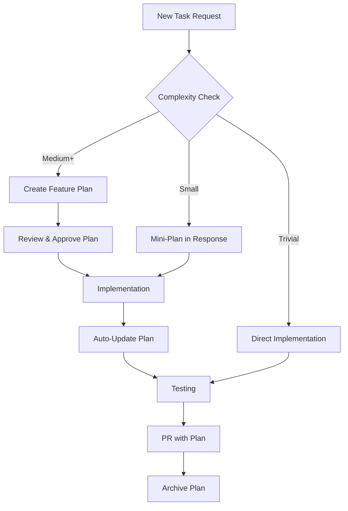

# Design Partner Workflow Guide

## Overview

The Design Partner Workflow transforms Claude from a simple code generator into a collaborative design partner that helps you plan, implement, and document features systematically. This system uses Claude Code hooks to enforce best practices and maintain high-quality code.

## What Problem Does This Solve?

- **Context Loss**: AI forgets previous conversations and decisions
- **Rushed Implementation**: Skipping planning leads to technical debt
- **Poor Documentation**: Implementation details get lost over time
- **Inconsistent Quality**: No systematic approach to feature development
- **Knowledge Gaps**: Team members can't understand previous decisions

## How It Works



## Quick Start Guide

### 1. Understand Complexity Levels

| Level | Criteria | Plan Required | Example |
|-------|----------|---------------|---------|
| **Trivial** | < 2 files, < 50 lines, < 30min | ❌ No | Fix typo, change color, add translation |
| **Small** | < 5 files, < 200 lines, < 2h | 📝 Mini-plan | Add button, new form field, simple endpoint |
| **Medium** | < 10 files, < 500 lines, < 1 day | ✅ Yes | New component, integration, refactoring |
| **Large** | < 20 files, < 1000 lines, < 3 days | ✅ Yes + Review | New feature, migration, architecture change |
| **Epic** | > 20 files, > 1000 lines, > 3 days | ✅ Break down | Platform changes, complete redesigns |

### 2. Basic Commands

```bash
/plan [feature-name]        # Create a new feature plan
/plans                      # List all active plans
/status                     # Show current progress
/archive [plan-name]        # Archive completed plan
```

### 3. Daily Workflow Examples

#### Morning: Start New Feature
```
You: "Add pet medication reminders to the system"
Claude: "This is a medium complexity feature requiring a plan..."
[Creates: /plans/active/pet-medication-reminders.md]
Claude: "Plan created. Please review before we begin implementation."

You: "Plan looks good, let's start with the database"
Claude: "Starting Phase 1: Database setup..."
[Implements while updating plan automatically]
```

#### Afternoon: Quick Fix
```
You: "Fix the typo in the booking confirmation email"
Claude: "Fixed typo in email template" 
[Implements directly - no plan needed for trivial changes]
```

#### Evening: Check Progress
```
You: "/status"
Claude: "📊 Medication Reminders: 6/10 tasks complete (60%)
Next: Implement email notifications, Add error handling"
```

## Understanding the Hooks System

### What Are Hooks?
Hooks are automatic scripts that run at specific points in your Claude interaction to ensure quality and maintain documentation.

### Hook Lifecycle

#### 🎯 UserPromptSubmit Hook
**Triggers**: When you submit any request  
**Purpose**: Analyzes task complexity  
**You see**: Suggestions about planning approach

```
You: "Add user profile photo upload"
Hook: [Analyzes keywords, estimates complexity]
Claude: "This is medium complexity. Let me create a plan first..."
```

#### 🚦 PreToolUse Hook  
**Triggers**: Before Claude writes/edits code  
**Purpose**: Ensures plan exists for complex changes  
**You see**: Either proceeds or blocks with helpful message

```
# Complex change without plan
You: "Implement payment processing"
Hook: [Checks for plan, finds none]
Claude: "🚫 Plan required. Use '/plan payment processing'"

# Trivial change
You: "Fix button color" 
Hook: [Recognizes trivial change]
Claude: [Proceeds directly]
```

#### 📝 PostToolUse Hook
**Triggers**: After Claude modifies code  
**Purpose**: Updates plan with implementation notes  
**You see**: Confirmation of plan updates

```
Claude: "Updated BookingForm.tsx"
Hook: [Adds implementation note to plan]
Claude: "✅ Plan updated - Progress: 5/8 tasks complete"
```

#### 🏁 Stop Hook
**Triggers**: When Claude finishes responding  
**Purpose**: Shows progress and suggests next steps  
**You see**: Progress summary and recommendations

#### 🚀 SessionStart Hook
**Triggers**: When starting new conversation  
**Purpose**: Loads relevant plans for context  
**You see**: Summary of active work

## Working with Plans

### Plan Structure

Every plan follows this structure:
- **Metadata**: Status, dates, complexity, branch
- **Overview**: Problem, solution, value
- **Success Criteria**: Clear completion conditions
- **Technical Approach**: Architecture and components
- **Implementation Plan**: Phased approach with estimates
- **Risk Assessment**: Potential issues and mitigation
- **Testing Strategy**: How to verify quality
- **Rollback Plan**: Safety net if issues arise

### Plan Statuses

| Status | Meaning | Action Required |
|--------|---------|-----------------|
| `draft` | Plan created, needs review | Review and approve |
| `active` | Currently being implemented | Continue development |
| `completed` | Implementation finished | Archive the plan |
| `archived` | Historical record | None |

### Plan Management

#### Creating Plans
```bash
# Automatic (recommended)
"Implement user authentication with social login"
# Claude detects complexity and creates plan automatically

# Manual
/plan user-authentication
# Creates plan template for you to fill in
```

#### Reviewing Plans
```bash
/plans                    # See all plans
/plans active            # Only active plans  
/status                  # Detailed progress view
```

#### Updating Plans
Plans update automatically as you work:
- Code changes trigger implementation notes
- Checklist items can be marked complete manually
- Status transitions happen automatically

#### Archiving Plans
```bash
/archive plan-name       # Archive specific plan
/archive completed       # Archive all completed plans
```

## Best Practices

### DO ✅

1. **Review plans before starting** - Plans are your implementation contract
2. **Work on one plan at a time** - Focus leads to quality
3. **Update plan status** - Mark completed checklist items
4. **Archive completed plans** - Keep workspace clean
5. **Use mini-plans for small tasks** - Balance planning with speed
6. **Link related plans** - Reference dependencies

### DON'T ❌

1. **Skip plans for complex features** - Hooks will block you anyway
2. **Leave plans in draft forever** - Archive or activate them
3. **Create multiple plans for one feature** - Keep scope focused
4. **Ignore hook warnings** - They prevent quality problems
5. **Delete plans** - Archive instead to preserve history
6. **Override plan requirements casually** - Use `/skip-plan` sparingly

## Advanced Usage

### Branch-Based Development
```bash
# Create feature branch
git checkout -b feature/user-notifications

# Plan automatically associates with branch
/plan user-notifications
# Creates: /plans/active/user-notifications.md

# Implementation tracked per branch
# Plan archives when feature merges
```

### Team Collaboration

#### For Developers
- Check for existing plans before starting work
- Update plan progress as you implement
- Document decisions in plan notes

#### For Team Leads  
- Review plans before implementation starts
- Ensure plans align with architecture
- Monitor plan complexity and scope

#### For Code Reviewers
- Verify PR includes plan updates
- Check implementation matches plan
- Suggest plan improvements

### Customization

#### Adjust Complexity Thresholds
Edit `.claude/settings.json`:
```json
{
  "complexity": {
    "thresholds": {
      "medium": {
        "maxFiles": 15,        // Your team's comfort level
        "maxLines": 750        // Adjust based on experience
      }
    }
  }
}
```

#### Override Settings (Temporarily)
```bash
# Skip plan requirement once
/skip-plan

# Add to your request
"Fix the login bug --no-plan"
```

## Troubleshooting

### "Plan required" but I disagree
```bash
# Option 1: Override once (use sparingly)
/skip-plan

# Option 2: Adjust thresholds in .claude/settings.json
# Option 3: Create a lightweight plan quickly
```

### Plan exists but hooks can't find it
```bash
# Check plan status
grep "Status:" plans/active/your-plan.md

# Ensure status is "active" not "draft"
```

### Too many old plans cluttering context
```bash
# Archive completed plans
/archive completed

# Run maintenance script
./scripts/archive-plans.sh
```

### Hooks not running
```bash
# Check permissions
ls -la .claude/hooks/

# Make executable if needed  
chmod +x .claude/hooks/*.sh

# Test hook manually
echo "test task" | .claude/hooks/classify-task.sh
```

## Directory Structure Reference

```
.claude/
├── settings.json           # Main configuration
├── settings.local.json     # Personal settings (gitignored)
├── hooks/                  # Automation scripts
│   ├── classify-task.sh    # Complexity analysis
│   ├── check-plan-requirement.sh  # Plan enforcement
│   ├── update-plan.sh      # Auto-documentation
│   ├── load-context.sh     # Session initialization  
│   └── show-progress.sh    # Progress tracking
├── commands/               # Custom slash commands
│   ├── plan.md            # /plan command
│   ├── plans.md           # /plans command  
│   ├── archive.md         # /archive command
│   └── status.md          # /status command
└── scripts/               # Maintenance utilities

plans/
├── .template.md           # Plan template
├── INDEX.md              # Quick navigation
├── active/               # Current development
│   ├── feature-x.md     # Active plan
│   └── bugfix-y.md      # Another active plan
├── completed/            # Recently finished
│   └── 2024-12/
│       └── feature-z.md
└── archive/              # Historical record
    └── 2024/
        └── q4/
            ├── completed/
            └── abandoned/
```

## Integration with Existing Workflow

### Git Integration
- Plans automatically associate with branch names
- Commit messages can reference plan progress
- PRs include plan updates for review
- Merge triggers plan archival

### CI/CD Integration
- Pre-commit hooks validate plan exists for large changes
- Post-merge hooks automatically archive completed plans
- Weekly cron job runs maintenance scripts

### IDE Integration
- Plans stored in git for version control
- Searchable with standard text search tools
- Compatible with markdown preview
- Links work in most IDEs

## Migration Guide

### Week 1: Observation Mode
- Install hooks in "warning only" mode
- Team gets familiar with plan structure  
- No blocking, just suggestions

### Week 2: Soft Enforcement
- Enable blocking for large changes only
- Create plans for new features
- Existing work continues as normal

### Week 3: Full Adoption  
- All new work follows plan workflow
- Archive old documentation
- Adjust thresholds based on team feedback

### Week 4: Optimization
- Review hook performance and accuracy
- Refine complexity detection rules
- Customize for team preferences

---

## Quick Reference

### Essential Commands
```bash
/plan [name]        # Create plan
/plans              # List plans  
/status             # Show progress
/archive [name]     # Clean up completed
```

### Complexity Decision Tree
```
Typo/style fix? → Just do it
Multiple files? → Mini-plan  
New feature? → Full plan
Architecture change? → Full plan + review
```

### Hook Bypass (Emergency)
```bash
/skip-plan          # Override once
--no-plan           # Add to request
```

This workflow ensures systematic, documented, high-quality development while maintaining the speed and flexibility you need for day-to-day work.